# Цель работы: 

Развитие профессиональных навыков работы в командной строке Windows.

# Задачи работы:

– Создание структуры каталогов;

– Создание, просмотр, редактирование, удаление файлов;

– Удаление структуры каталогов;

– Манипулирование операционной системой Windows с
помощью командной строки.

# Вариант № 5: В строке приглашения вывести текущую версию системы.

# Задание на лабораторную работу

Загрузить командную строку (Пуск – Программы –
Стандартные – Командная строка).

1) В каталоге Temp создать дерево каталогов по
вариантам как показано в вариантах заданий с использованием
команд табл. 1.

# 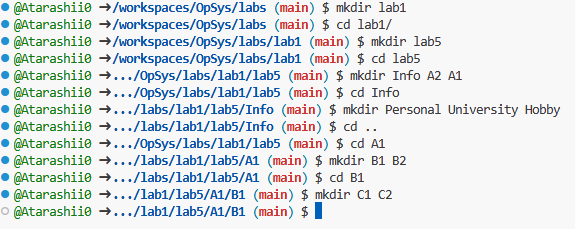

# 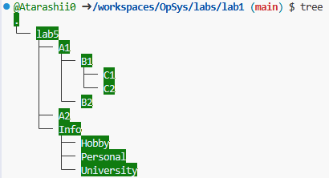 

2 ) В каталоге А2 создать подкаталоги В4 и В5 и удалить
каталог В2.

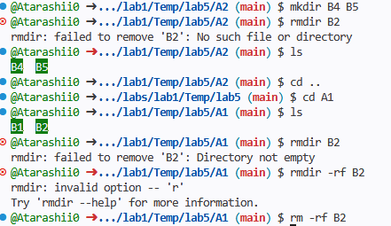

3 ) В каталоге Personal создать файл Name.txt,
содержащий информацию о фамилии, имени и отчестве
студента. Здесь же создать файл Date.txt, содержащий
информацию о дате рождения студента. В этом же каталоге
создать файл School.txt, содержащий информацию о школе,
которую закончил студент.

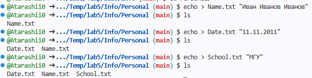

4 ) В каталоге University создать файл Name.txt,
содержащий информацию о названии вуза и специальность, на
которой студент обучается. Здесь же создать файл Mark.txt с
оценками на вступительных экзаменах и общей суммой баллов.

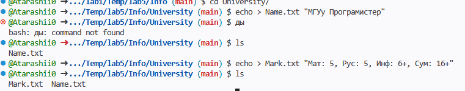

5 ) В каталоге Hobby создать файл hobby.txt с
информацией об увлечениях студента.

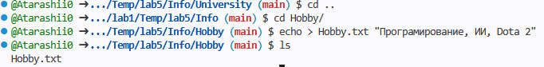

6 ) Скопировать файл hobby.txt в каталог А2 и
переименовать его в файл Lab_№варианта.txt.

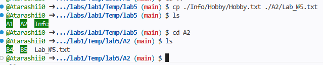

7 ) Сделать копию файла Lab_№варианта.txt (например,
copy_Lab_№варианта.txt ) в этом же каталоге и удалить его.

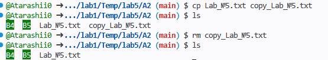

8 ) Очистить экран от служебных записей.

9 ) Вывести на экран поочередно информацию,
хранящуюся во всех файлах каталога Personal.

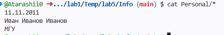

10 ) Отсортировать все файлы, хранящиеся в каталоге
Personal, по имени.

11 ) Объединить все файлы, хранящиеся в каталоге
Personal, в файл all.txt и вывести его содержимое на экран.

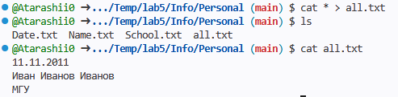

12 ) Отредактировать файл all.txt, добавив в него год
вашего рождения, и вывести его содержимое на экран.

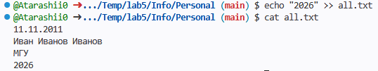

13 ) Скопировать файл all.txt в директорию А1.

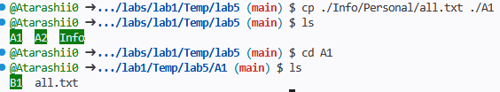

14 ) Удалить все директории, в названии которых есть
буква A или цифра 2.

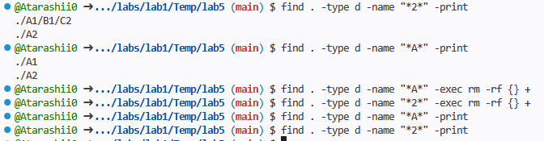

15 ) Изменить строку приглашения в соответствии с
номером варианта.

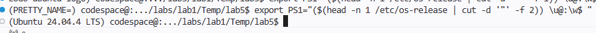

# Контрольные вопросы

1. Что такое командная строка?

Командная строка (CLI) — это текстовый интерфейс для взаимодействия человека с компьютером. В отличие от графического интерфейса, здесь команды вводятся вручную с клавиатуры.

2. Перечислите основные команды управления
файлами в командной строке.

dir — просмотр содержимого папки; cd — переход в другую папку; copy — копирование; move — перемещение; del (или erase) — удаление файлов; mkdir (или md) — создание папки.

3. Перечислите команды вывода основной
информации системы.

systeminfo — полные данные о системе и "железе"; ver — версия ОС; hostname — имя компьютера; ipconfig — настройки сетевых адаптеров.

4. Перечислите команды ввода/вывода файлов.

type — вывод содержимого файла на экран; echo — запись текста в файл (через перенаправление >); more — постраничный просмотр длинных файлов; find — поиск текстовой строки в файле.

5. Возможно ли полноценное управление системой,
пользуясь только командной строкой? Ответ обоснуйте.

Да, возможно (особенно в серверных ОС). Почти любое действие в GUI — это лишь "обертка" над системной командой. Через терминал можно управлять процессами, правами доступа, сетью и реестром быстрее и точнее, чем мышкой.

6. Подумайте, чем отличается командная строка
Windows от командной строки MS-DOS, несмотря на их
схожесть в командах.

MS-DOS была самостоятельной операционной системой, которая управляла ресурсами ПК напрямую. Командная строка Windows (CMD) — это эмулятор (приложение), запущенный внутри графической среды Windows. В CMD доступны многозадачность и длинные имена файлов, чего не было в классическом DOS.

7. Приведите примеры интерпретаторов команд в
других операционных системах.

Linux/macOS: Bash, Zsh, Fish; Windows (альтернатива CMD): PowerShell.
