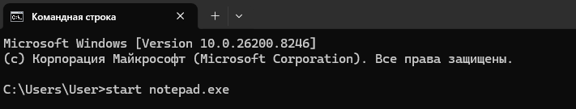
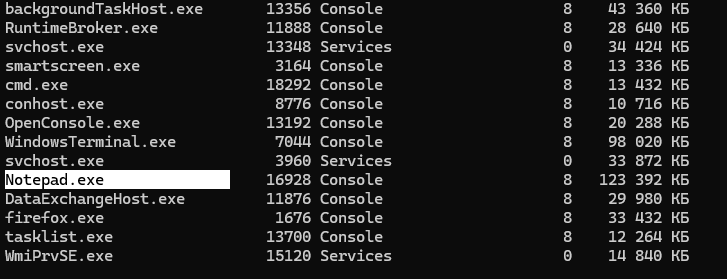
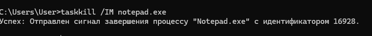
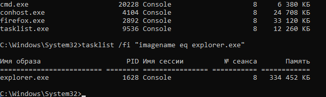
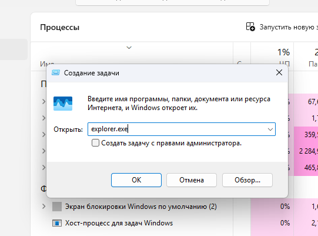
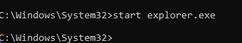

# Лабораторная работа 2

# Управление памятью и процессами в ОС Windows
Цель работы: Практическое знакомство с управлением
вводом/выводом в операционных системах Windows и
кэширования операций ввода/вывода.

# План проведения занятия:

1. Ознакомиться с краткими теоретическими
сведениями.

3. Ознакомиться с назначением и основными
функциями Диспетчера задач Windows.

5. Приобрести навыки применения командной строки
Windows. Научиться запускать останавливать и проверять
работу процессов.

7. Сделать выводы о взаимосвязи запушенных
процессов и оперативной памятью компьютера.

9. Подготовить отчет для преподавателя о выполнении
лабораторной работы и записать его в папку «Выполнение».

# Ход работы

# Задание 1. Работа с Диспетчером задач Windows.

1. Запустите Windows;

2. Запуск диспетчера задач можно осуществить
двумя способами:

1 ) Нажатием сочетания клавиш Ctrl+Alt+Del. При
использовании данной команды не стоит пренебрегать
последовательностью клавиш. Появится меню, в котором
курсором следует выбрать пункт «Диспетчер задач».

2 ) Переведите курсор на область с показаниями
системной даты и времени и нажмите правый клик, будет
выведено меню, в котором следует выбрать «Диспетчер задач».

3. В диспетчере задач есть 6 вкладок:

1 ) Приложения;

2 ) Процессы;

3 ) Службы;

4 ) Быстродействие;

5 ) Сеть;

6 ) Пользователи.

Вкладка «Приложения» отображает список запущенных
задач (программ) выполняющиеся в настоящий момент не в
фоновом режиме, а также отображает их состояние. Также в
данном окне можно снять задачу переключиться между
задачами и запустить новую задачу при помощи
соответствующих кнопок.

Вкладка «Процессы» отображает список запущенных
процессов, имя пользователя запустившего процесс, загрузку
центрального процессора в процентном соотношении, а также
объем памяти используемого для выполнения процесса. Также
присутствует возможность отображать процессы всех
пользователей, либо принудительного завершения процесса.
Процесс — выполнение пассивных инструкций компьютерной
программы на процессоре ЭВМ.

Вкладка «Службы» показывает, какие службы
запущены на компьютере. Службы— приложения,
автоматически запускаемые системой при запуске ОС Windows
и выполняющиеся вне зависимости от статуса пользователя.

Вкладка «Быстродействие» отображает в графическом
режиме загрузку процессора, а также хронологию
использования физической памяти компьютера. Очень
эффективным инструментом наблюдения является «Монитор
ресурсов». С его помощью можно наглядно наблюдать за
каждой из сторон «жизни» компьютера. Подробное изучение
инструмента произвести самостоятельно, интуитивно.

Вкладка «Сеть» отображает подключенные сетевые
адаптеры, а также сетевую активность.

Вкладка «Пользователи» отображает список
подключенных пользователей.

4. Потренируйтесь в завершении и повторном запуске
процессов.

5. Разберите мониторинг загрузки и использование
памяти.

6. Попытайтесь запустить новые процессы при
помощи диспетчера, для этого можно использовать команды:
cmd, msconfig.

# Задание 2. Командная строка Windows.

1. Для запуска командной строки в режиме
Windows следует нажать:
(Пуск) > «Все программы» > «Стандартные» > «Командная
строка»

2. Поработайте выполнением основных команд
работы с процессами: запуская, отслеживая и завершая
процессы.
Основные команды[1][2]:
Schtasks — выводит выполнение команд по расписанию;
Start — запускает определенную программу или
команду в отдельном окне;
Taskkill — завершает процесс;
Tasklist — выводит информацию о работающих
процессах.

3. В появившемся окне наберите:
cd\ — переход в корневой каталог;
cd windows – переход в каталог Windows;
dir — просмотр содержимого каталога.
В данном каталоге мы можем работать с такими
программами как «WordPad» и «Блокнот».

4. 1 ) Запустим программу «Блокнот»:
C:\Windows > start notepad.exe

2 ) Отследим выполнение процесса: C:\Windows > tasklist

3 ) Затем завершите выполнение процесса: C:\Windows >
taskkill /IM notepad.exe

5. Самостоятельно, интуитивно, найдите команду
запуска программы WordPad.
Необходимый файл запуска найдите в папке Windows.

6. Выполнение задания включить в отчет по
выполнению лабораторной работы.

# Задание 3. Самостоятельное задание.

1. Отследите выполнение процесса explorer.exe при
помощи диспетчера задач и командной строки.

2. Продемонстрируйте преподавателю завершение и
повторный запуск процесса explorer.exe из:

1 ) Диспетчера задач.

2 ) Командной строки.

4. Выполнение задания включить в отчет по
выполнению лабораторной работы.

# Контрольные вопросы

1. В чем заключается суть управления
вводом/выводом в операционной системе?

ОС выступает посредником между программами и «железом» (дисками, клавиатурой, принтером). Она скрывает техническую сложность устройств, предоставляет им общие правила работы (через драйверы) и следит, чтобы разные процессы не обращались к одному устройству одновременно, вызывая сбои.

2. Характеристика «Диспетчера задач Windows».
Перечислите основные его функции.

Это системная утилита для мониторинга ресурсов компьютера в реальном времени.
Основные функции: завершение зависших программ, контроль нагрузки на ЦП/память/диск, управление автозагрузкой, просмотр активных служб и сетевой активности.

3. Что такое процесс в операционной системе?

Это экземпляр программы, которая выполняется в данный момент. У процесса есть выделенная ему оперативная память, адресное пространство и системные ресурсы. Один файл (например, chrome.exe) может породить сразу несколько процессов.

4. В чем сходство и различие понятий
«приложение» и «процесс»? Приведите примеры.

Сходство: Оба представляют собой программный код, выполняемый системой.

Различие: Приложение — это то, что видит пользователь (окно программы), а процесс — это техническая единица работы для ОС.

Пример: Приложение «Браузер» открыто одно, но в Диспетчере задач вы видите 10 процессов (по одному на каждую вкладку и расширение).

5. Что такое служба в операционной системе?

Это специальная программа, которая работает в фоновом режиме без участия пользователя. Она запускается часто еще до входа в систему и не имеет графического интерфейса (окна).

6. В чем различие между «службой» и
«процессом»? Приведите примеры.

Различие: Любая служба работает как процесс, но не любой процесс — служба. Службы выполняют системные задачи (обновления, печать, сеть), а обычные процессы инициируются пользователем.

Пример: Процесс notepad.exe (Блокнот) закроется, если вы выйдете из системы. Служба Print Spooler (Очередь печати) продолжит работать, даже если на компьютере никто не залогинен.

7. Перечислите основные команды работы с
процессами при помощи командной строки.

tasklist — просмотр списка всех запущенных процессов; taskkill — принудительное завершение процесса (например, taskkill /f /im notepad.exe).
