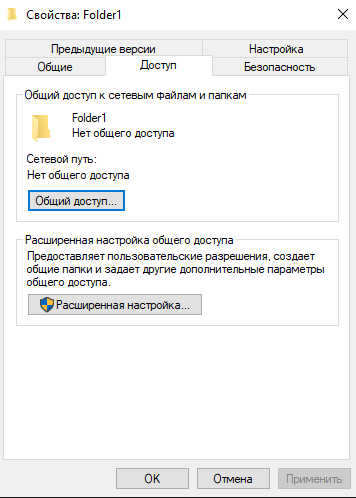
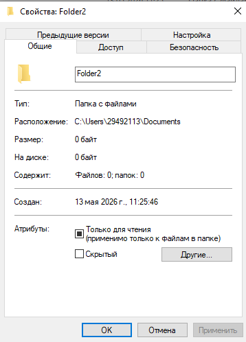
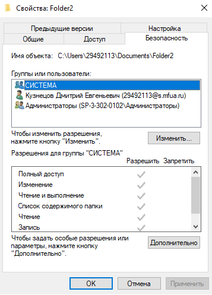

# Лабораторная работа № 3 Использование приёмов работы с файловой системой NTFS. Назначение разрешений доступа к файлам и папкам.

# Цель работы: 
Научиться устанавливать разрешения
NTFS для файлов и для папок для отдельных пользователей и
групп в операционной системы Windows ХР, а также устранять
проблемы доступа к ресурсам.

# Ход работы:

1) Доступы у папки Folder1

2) Разрешения у папки Folder1

3) Доступы у папки Folder2

4) Разрешения у папки Folder2

## Вывод
В ходе выполнения лабораторной работы были освоены базовые и продвинутые механизмы управления доступом на уровне файловой системы NTFS. Изучены принципы функционирования списков ACL и записей ACE. На практике закреплены навыки назначения разрешений для учетных записей и групп, проанализированы механизмы наследования и вычисления эффективных прав. Также были изучены методы диагностики и устранения типовых проблем с доступом, связанных с конфликтом разрешающих и запрещающих правил.
