# Лабораторная работа по процессам в Linux

# Цель работы:

Запуск задачи в активном и фоновом режиме;

Заставить задачу выполнятся после выхода из системы;

Отслеживать и сортировать активные процессы;

Завершать процессы;

# Постараемся разобрать следующие понятия:

Fg (foreground) и bg (background);

Nohup (no hang up);

Ps - информация об активных процессах;

Pstree - дерево процессов;

Pgrep - поиск процессов;

Pkill - завершение процессов;

Top - диспетчер задач;

Free - загрузка оперативной памяти;

Uptime - время и полнота загрузки;

Screen - управление сессиями.

# 1. Запуск задач в активном и фоновом режиме (Foreground и Background)

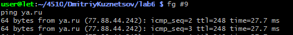

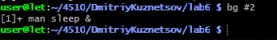

# 2. Nohup

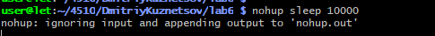

# 3. Ps

Команда ps (Статический снимок процессов)

 ps aux — показывает процессы всех пользователей с подробностями.
Команда grep - отсортировать.

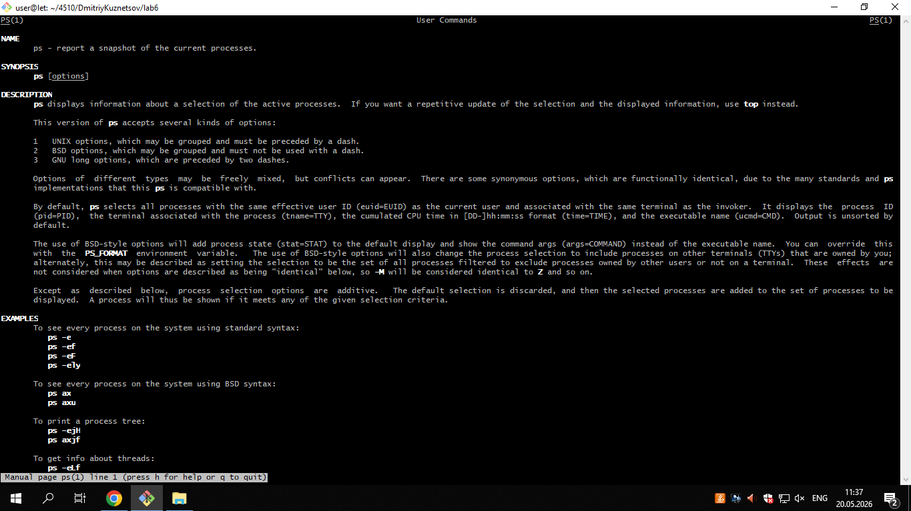

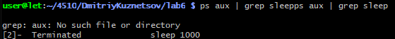

# 4. Pstree

Команда pstree (Дерево процессов)

Показывает иерархию (родительские и дочерние процессы).

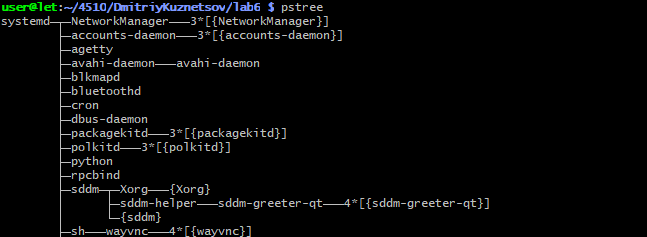

# 5. Pgrep

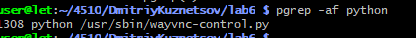

# 6. Pkill

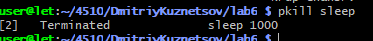

# 7. Top

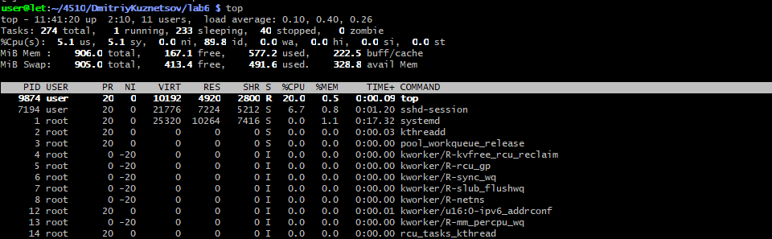

# 8. Free

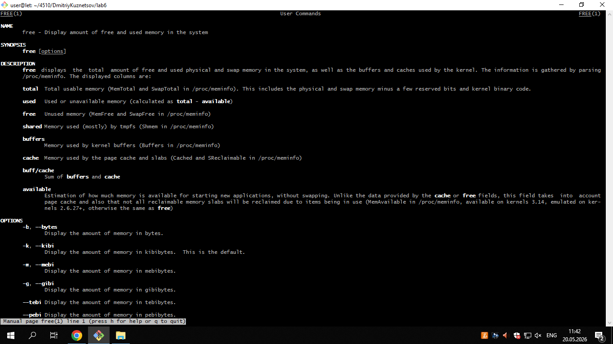

# 9. Uptime

Команда uptime (Время работы и нагрузка)

Показывает текущее время, время аптайма, количество пользователей и среднюю нагрузку за 1, 5 и 15 минут.

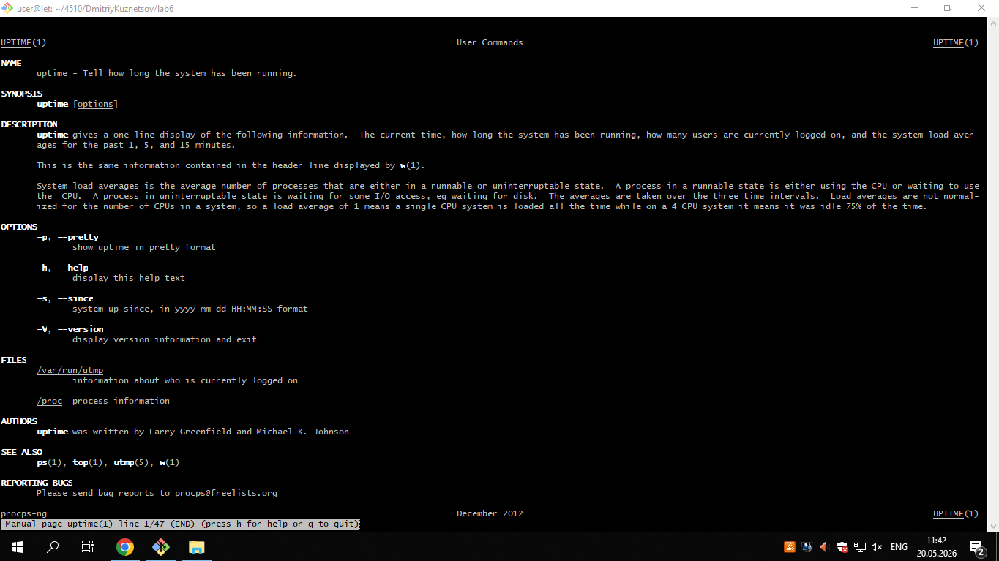

# 10. Sleep

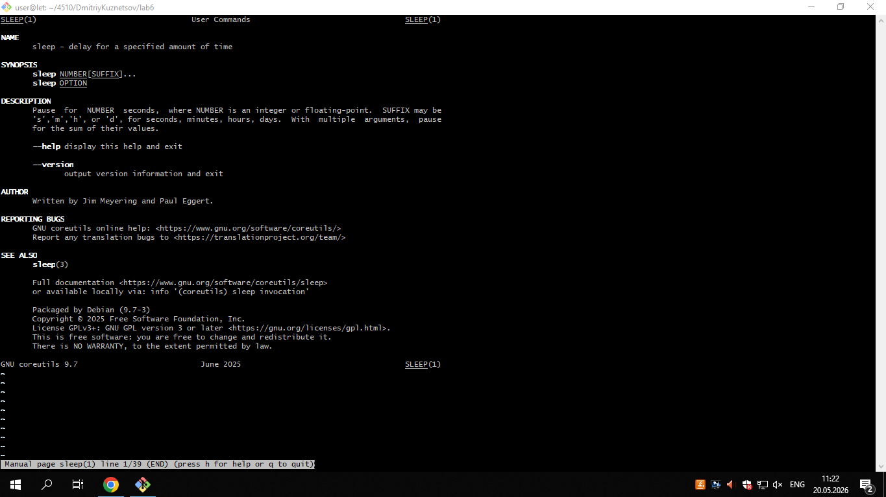

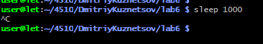

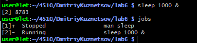

# 11. Ping

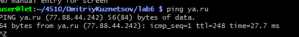

# 12. Kill

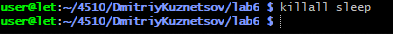

# Вывод: В ходе выполнения лабораторной работы были освоены практические навыки управления процессами и мониторинга системных ресурсов в операционной системе Linux. 
